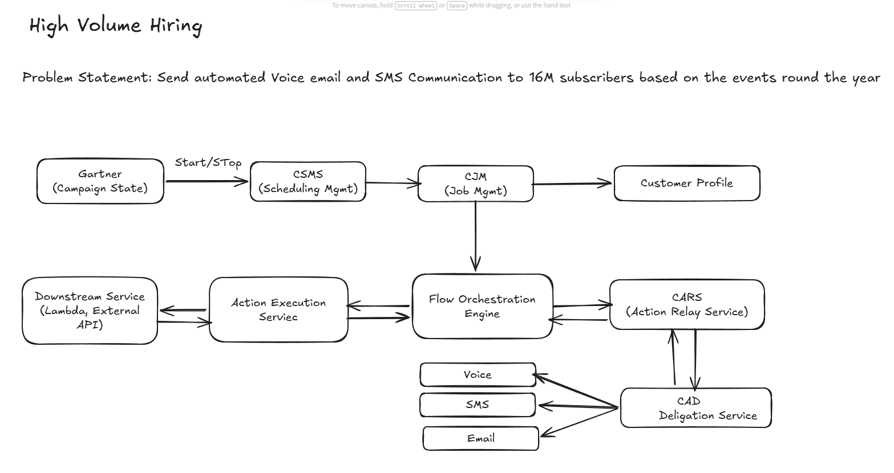
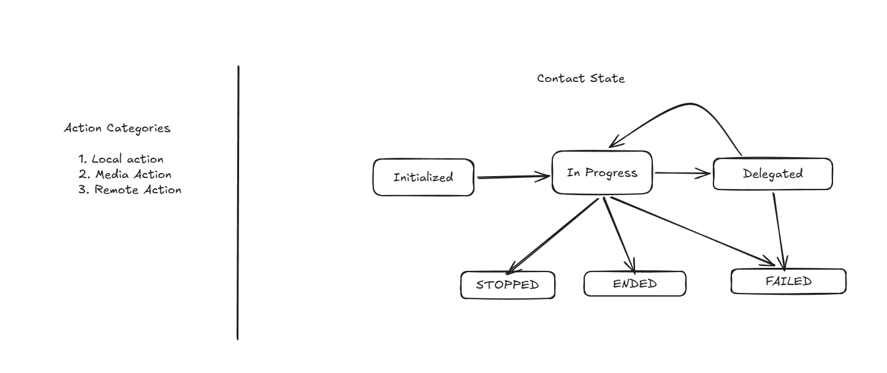

# Campaign Orchestration Platform Migration Deep Dive

## Problem Statement

*   **The Problem:** I led the migration of the Amazon High-Volume Hiring (HVH) automated outbound email and SMS communications from Amazon Pinpoint to Amazon Connect.
*   **Those Affected:** This initiative directly impacted the internal HVH business, which serves job seekers across 8 countries, as well as the internal lifecycle teams that manage these hiring journeys.
*   **Why It Mattered:** We needed to consolidate high-volume orchestration for ingestion and wait/journey execution onto Connect as the strategic go-forward platform to avoid Pinpoint's baseline retirement. The scale of this operation was massive, with the journey estate reaching roughly 16M live production profiles in `us-east-1` alone.
*   **My Role:** As a Senior Software Engineer on the team, I was responsible for evaluating the architecture, making the core technical design decisions, and driving the end-to-end migration execution across regions.

## Solutions Explored

*   I evaluated four candidate architectures against seven weighted criteria, prioritizing scale, long-lived state management, and multi-tenant isolation.
*   I eliminated Option A (staying on Amazon Pinpoint) because it failed our strict residency, integration, and control criteria.
*   I rejected Option B (building a bespoke journey orchestrator using Step Functions and DynamoDB) because the extreme cost and risk associated with recreating a mature platform from scratch could not be justified.
*   I eliminated Option D (adopting a third-party SaaS platform) early in the evaluation due to its weak integration with internal Amazon Customer Profiles and prohibitive costs at our required volume.
*   I ultimately selected Option C (Amazon Connect outbound campaigns via FOS and FAES) because it natively supported the exact primitives we needed, such as looping and segment re-checks. Connect offered the strongest scale, long-lived state isolation, and expressiveness for our strategic consolidation target.

## Architecture Diagram

## Technical Considerations

*   **Availability vs. Latency:** I prioritized availability over latency by holding state in a durable row and making remote actions asynchronous. This deliberate trade-off exchanged seconds-to-minutes of latency for guaranteed state preservation across month-long user journeys.
*   **Throughput vs. Cost:** Rather than massively over-provisioning compute resources for traffic spikes, I decoupled the system using SQS, SNS, and Kinesis to absorb wait-exit bursts. This allowed downstream consumers to drain at a consistent, sustainable rate.
*   **Isolation vs. Utilization:** I implemented a shared multi-tenant fleet governed by strictly enforced bounds. By relying on per-cell sharding and precise quotas, I ensured that bursty noisy neighbors could not starve other tenants of resources.
*   **Core Execution Mechanic:** To handle the physical constraints of the fleet during extended waits, I utilized a "freeze/thaw" mechanic. Instead of holding an active thread open for months, the flow engine checkpoints its state to DynamoDB and releases the thread, resuming execution only when an asynchronous result triggers it.

## Measuring Success

*   **The Baseline:** The incumbent Pinpoint system peaked at delivering approximately 5M emails within a 2-hour window and 410K SMS messages within a 4-hour window.
*   **The Goal:** My primary target was to meet or beat this 2025 Pinpoint baseline with absolute zero message loss and zero noisy-neighbor degradation.
*   **The Outcome:** The migration was highly successful, empirically validating Connect's flow-orchestration model against our target volumes and fully achieving the zero message loss requirement during the cutover.
*   **Data-Driven Iteration:** I utilized live production traffic to tune the design and gate the regional cutovers. Every load test evaluated our core targets, and any missed metric fed directly back into design and capacity adjustments before we permitted scaling to the next region.

## Key Learnings

*   **What Surprised Me:** I underestimated how dominant synchronized wait-exits would become as a primary load driver. The infrastructure was heavily impacted by large cohorts of profiles exiting wait states at the exact same moment.
*   **What I Would Change:** Next time, I would treat wait-exit burst modeling as a mandatory, required deliverable during the initial design phase rather than analyzing the burstiness reactively.
*   **How My Approach Evolved:** I learned that baseline data must be derived directly from the quantified incumbent system prior to any new design work. Furthermore, I recognized that cross-system read-after-write operations require explicit SLAs, which reinforced the need to enumerate every cross-system data dependency up front.
